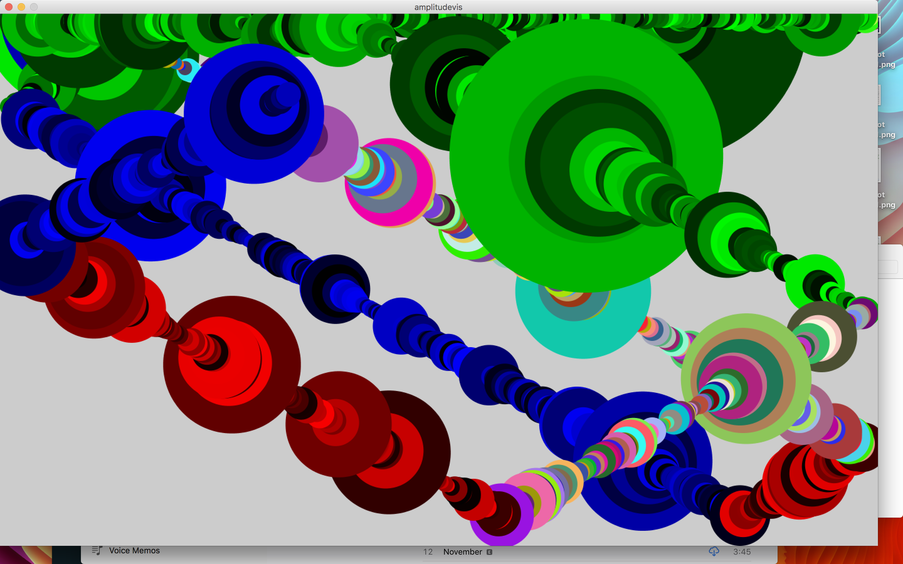
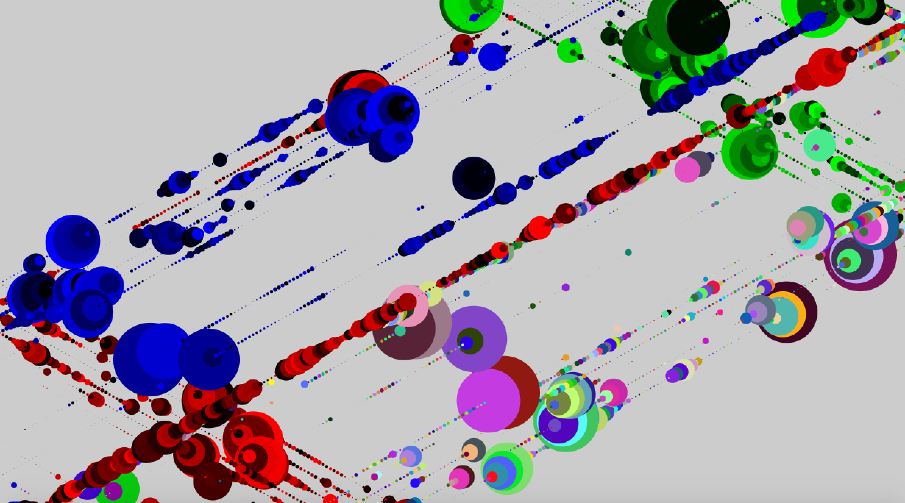
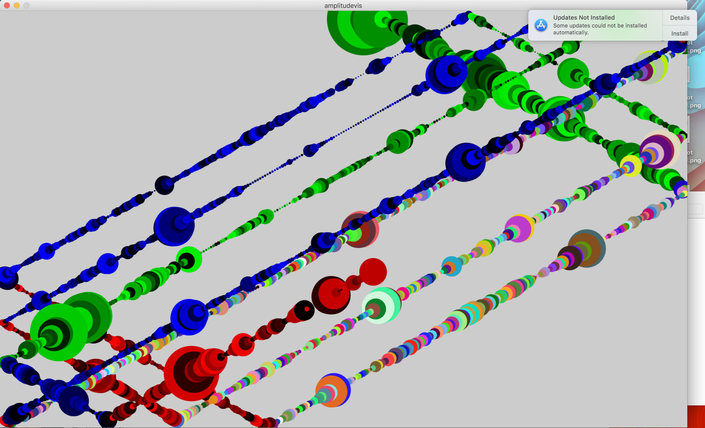
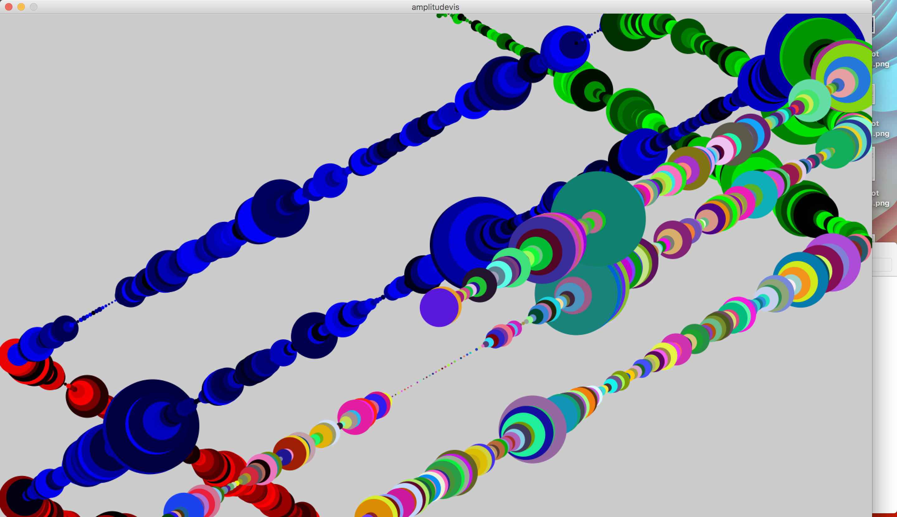

# Amplitude Visualizer

This program takes audio input from where ever the computer does (usually the microphone). A ball bouncing around in the window (not unlike [the screensaver DVD players use](https://www.youtube.com/watch?v=QOtuX0jL85Y)) changes color based on which wall it has recently touched, and its diameter at any given time is a function of the volume of the audio input stream. I left some [examples](https://github.com/KLaFleur/Amplitude-Vis#examples) where the input were different pieces of music below.

## Insights

Nothing too earth shattering here, but its cool to see dynamics mapped out in time. If a recording has hits, swells, or a really strong 2 and 4, it pops out at you; its especially fun to watch live.

## Examples 

 

