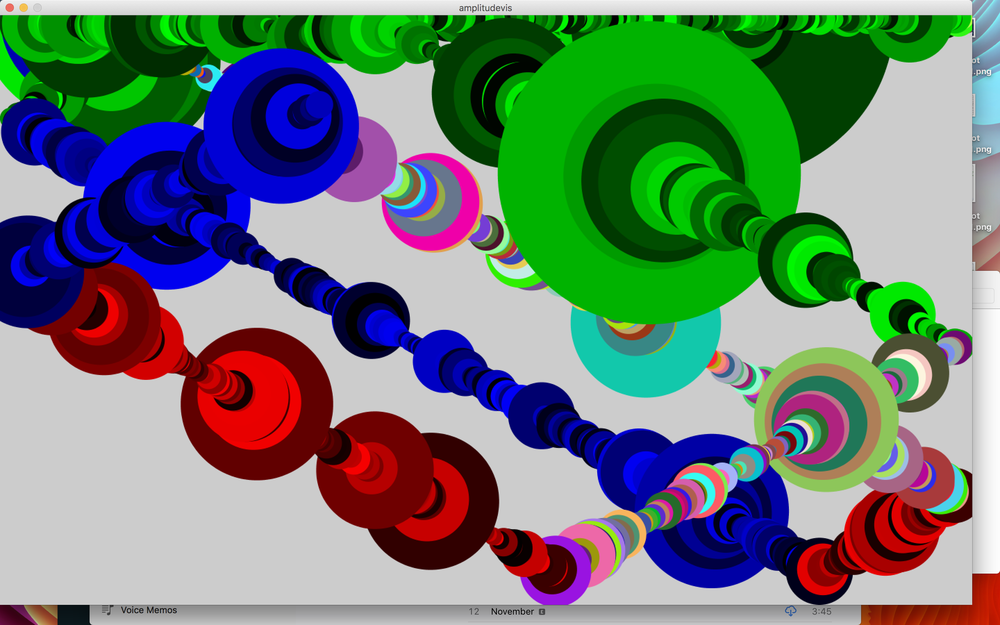
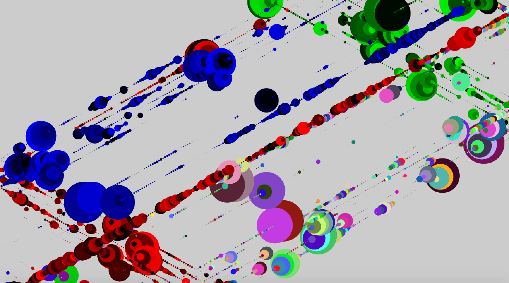
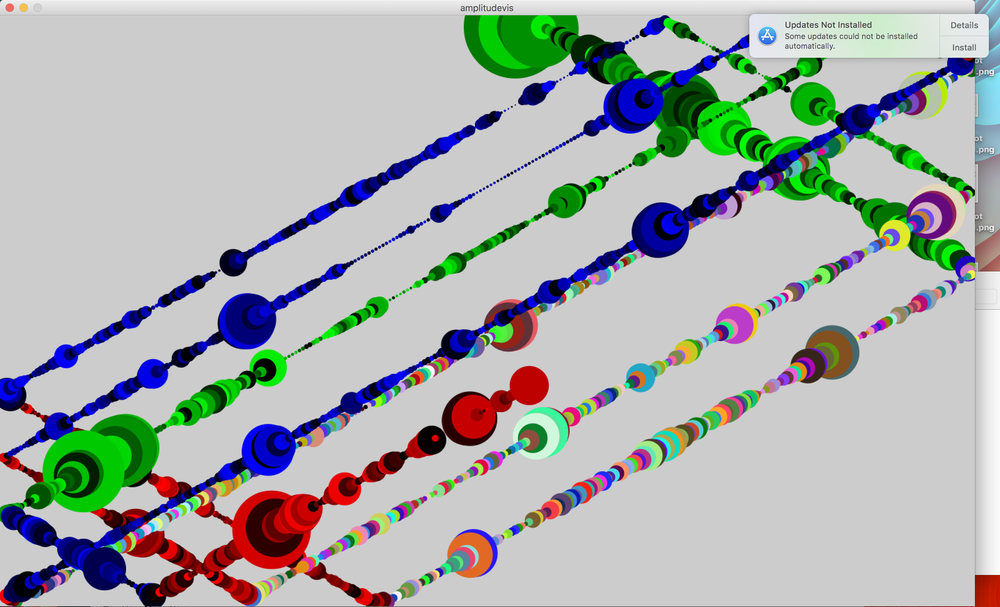
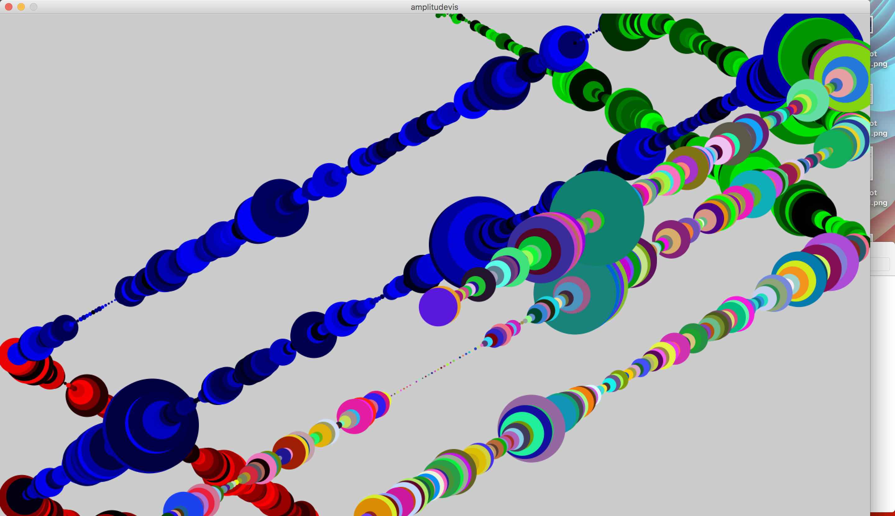

# Amplitude Visualizer

This program takes audio input from where ever the computer does (usually the microphone). A ball bouncing around in the window (not unlike [the screensaver DVD players use](https://www.youtube.com/watch?v=QOtuX0jL85Y)) changes color based on which wall it has recently touched, and its diameter at any given time is a function of the volume of the audio input stream. I left some examples where the input were different pieces of music below.

 

